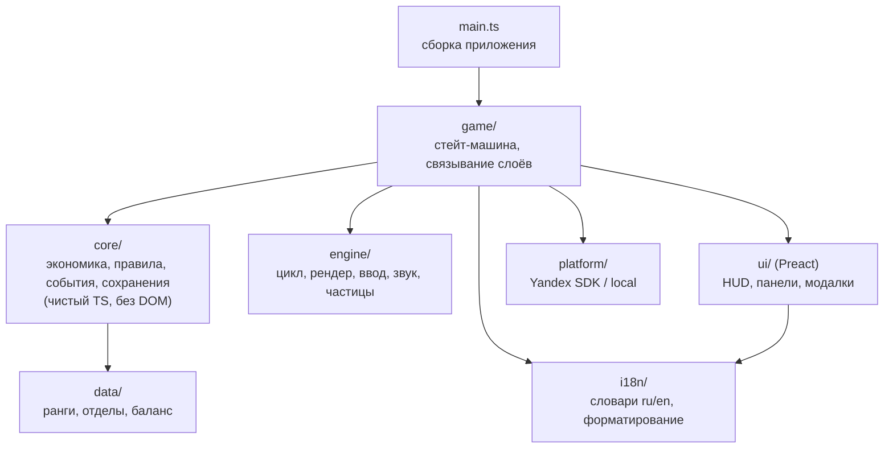

# Архитектура — «Конторка: Батраканы»

> Фаза 3, 29.09.2026. Основано на [`gdd.md`](gdd.md).
> Цифры веса ниже — **собственные замеры**, а не данные из блогов: минимальное приложение на каждом движке собрано `bun build --minify` (Bun 1.3.11) и сжато `gzip -9`.

---

## 1. Решение в двух словах

- **Рендер:** собственный тонкий слой на **Canvas2D** за интерфейсом `Renderer`. Запасной вариант — PixiJS, если на реальном телефоне в Фазе 5 не удержим FPS.
- **3D-вид без 3D в рантайме:** low-poly модели строятся кодом на **Three.js** и пререндерятся в **headless Chromium через Playwright** в спрайт-атласы. В игру попадают только PNG.
- **UI:** DOM-оверлей на **Preact** (5.6 КБ gzip, привычный тебе JSX и хуки).
- **Звук:** синтез через **WebAudio** прямо в рантайме. Аудиофайлов 0 байт.
- **Логика:** чистый TypeScript в `src/core` без DOM, покрыт тестами `bun test`.
- **Платформа:** интерфейс `Platform` с двумя реализациями, `YandexPlatform` и `LocalPlatform`. Игра не знает, запущена она на Яндексе или нет.
- **Тулинг:** Bun (менеджер пакетов, dev-сервер, бандлер, тесты), TypeScript 6.0 strict, ESLint strictTypeChecked, Prettier.
- **Зависимости в бандле:** только `preact`.

---

## 2. Выбор рендера

### 2.1. Что на самом деле нужно рисовать

Сначала требования. У нас до 12 батраканов за столами, 1–2 дебика, записка, до ~200 частиц (циферки, кукиши, конфетти), тряска экрана и вспышки. Все персонажи — готовые кадры из атласа. Текста в канвасе почти нет: цифры и панели живут в DOM. Для рендера это лёгкая нагрузка: не шутер с тысячами объектов, а «кукольный театр» из пары десятков спрайтов.

### 2.2. Сравнение

Вес — это минимальное приложение (спрайт или прямоугольник, текст, анимация), без нашего кода.

| Вариант | Версия | min, КБ | gzip, КБ | Старт на мобиле | Порог входа для тебя | Подходит к игре |
|---|---|---:|---:|---|---|---|
| **Свой Canvas2D** | — | 0.3 | **0.2** | мгновенный: парсить нечего | средний: цикл, атлас и частицы пишем сами, зато всё прозрачно и учит основам геймдева | ✅ 20–200 объектов для Canvas2D не нагрузка |
| **Kaplay** | 3001.0.19 | 184 | 68 | быстрый | низкий: простой API, но глобальные функции и своя модель объектов | 🟡 удобен для прототипа, хуже контроль аллокаций в цикле |
| **Three.js** (настоящее 3D) | 0.186.1 | 525 | 131 | средний: компиляция шейдеров, 3D-сцена | высокий: 3D-математика, свет, камеры | 🔴 интерактивное 3D нам не нужно, нужен только его вид |
| **PixiJS** | 8.21.0 | 543 | 159 | средний: ~0.5 МБ JS на парсинг | средний: знакомая модель «сцена/спрайт» | 🟢 WebGL-батчинг и запас по производительности; держим как запасной план |
| **Phaser** | 4.2.1 | 1375 | 362 | медленнее всех | низкий: «всё включено», но навязывает свою архитектуру сцен и объектов | 🔴 тяжело для «кукольного театра», конфликтует с нашим разделением слоёв |

### 2.3. Почему свой Canvas2D

1. **Вес и старт.** Цель GDD — интерактив за ≤ 3 с на среднем Android и 4G. Каждые 100 КБ JS — это не только загрузка, но и парсинг на слабом процессоре. Свой слой не стоит ничего.
2. **Хватает производительности.** Отрисовка кадра из атласа (`drawImage`) в Chrome для Android ускоряется на GPU. Несколько сотен таких вызовов за кадр укладываются в бюджет 16 мс с запасом. Это нужно подтвердить замером на реальном телефоне в Фазе 5.
3. **Полный контроль над аллокациями.** Требование брифа — ноль аллокаций в игровом цикле. В своём коде мы это гарантируем: пулы, типизированные массивы, без замыканий в кадре.
4. **Обучение.** Ты впервые в геймдеве. Свой рендер на ~300 строк показывает, как устроены игровой цикл, атласы, интерполяция и частицы. После этого любой движок читается легко.

**Запасной план.** Рендер спрятан за интерфейсом `Renderer` (§6). Если в Фазе 5 на тестовом телефоне FPS окажется ниже 55, подключаем PixiJS внутри того же интерфейса: +159 КБ gzip, всё ещё далеко от бюджета в 2.5 МБ. Логику и UI это не затрагивает.

### 2.4. Почему 3D-вид делаем пререндером

Эстетика мема — «3D из начала 2000-х». Живое 3D дало бы +131 КБ, компиляцию шейдеров и нагрузку на GPU. При этом камера у нас фиксированная, и игрок никогда не увидит модель с другой стороны. Пререндер даёт тот же вид: модели и анимации строятся на Three.js, рендерятся в кадры на машине разработчика, а в игру уходят готовые спрайты. Так же делали Donkey Kong Country и Diablo II.

### 2.5. Пайплайн 3D-ассетов: Three.js + Playwright против Blender

| Вариант | Что нужно | Плюсы | Минусы |
|---|---|---|---|
| **Three.js + headless Chromium (Playwright)** ✅ | `bun`, пакет `playwright` + Chromium (~150 МБ) | весь код на TypeScript, тот же язык и рантайм, что у игры; тот же рендерер, что был бы в браузере | рендер проще, чем в Blender (для low-poly с плоским шейдингом это не важно) |
| Blender через `bpy` из PyPI | Python строго нужной версии + колесо **~400 МБ** | лучший рендер, привычный индустриальный инструмент | `bpy` 5.2 требует Python 3.13, в нашей среде 3.11; хрупкая связка версий; второй язык в проекте |
| Установленный Blender CLI | Blender на каждой машине | то же | в этой среде Blender не установлен; ставить вручную у каждого участника |

Выбираем Three.js + Playwright. Детали пайплайна (генерация моделей, кадры, атлас, палитра) — в Фазе 4.

---

## 3. Слои и правила зависимостей



**Правила:**

- `core` зависит только от `data`. Никакого DOM, рендера, UI и платформы. Это проверяет ESLint (`no-restricted-imports`, `no-restricted-globals` в `eslint.config.js`), и проверка протестирована на намеренном нарушении.
- `data` и `i18n` — листовые модули без зависимостей от приложения.
- `engine`, `ui` и `platform` не знают друг о друге. Связывает их только `game`.
- Итог: логику можно прогнать в тестах и в симуляторе баланса (Фаза 6) без браузера. Рендер или SDK можно заменить, не трогая правила игры.

---

## 4. Игровой цикл

- **rAF + фиксированный шаг симуляции 50 мс (20 Гц).** Реализовано и покрыто тестами: `src/engine/fixed-step.ts` и `src/engine/loop.ts`.
- Зачем фиксированный шаг: частота кадров плавает (60, 30, 120 Гц, провалы). Если считать экономику «за кадр», один и тот же игрок на разных телефонах зарабатывал бы разное. Симуляция всегда идёт шагами по 50 мс, а рендер рисует так часто, как может, и сглаживает анимации по `alpha`.
- 20 Гц достаточно: idle-экономике не нужна физика на 60 Гц, а мы экономим батарею.
- **Потолок кадра 250 мс:** после зависания не прогоняем сотни шагов подряд.
- **Пауза** (реклама, скрытая вкладка) полностью останавливает rAF: не работают ни симуляция, ни рендер, ни звук.
- **Время отсутствия.** Если вкладка была скрыта дольше 60 с, при возврате доход считается так же, как оффлайн (модалка «Отгул»). Если короче, это просто пауза. Длительность считается по `serverTime()` SDK, а без него по `Date.now()` с защитой от перевода часов назад.

---

## 5. Состояние, команды и события (вместо ECS)

**Почему не ECS.** Entity-Component-System окупается, когда сущностей тысячи и у них много комбинируемых свойств. У нас 12 столов, 2 дебика, 1 записка и частицы. ECS добавил бы абстракцию без выгоды, поэтому модель данных плоская и явная.

### 5.1. Состояние симуляции (`core`)

```ts
interface OfficeState {
  desks: Int8Array;          // 12 ячеек: ранг батракана (0 — пусто)
  deskCount: number;         // открыто столов (8..12)
  kukishi: number;           // мягкая валюта
  hiresByLevel: Uint16Array; // сколько нанято каждого уровня в забеге (для цены)
  maxRank: number;           // максимальный ранг в забеге
  seniority: number;         // выслуга (prestige)
  earnedThisRun: number;
  totalEarned: number;
  collection: number;        // битовая маска открытых рангов (картотека)
  buffs: BuffSlots;          // фиксированные слоты: премия, аврал, калоид (оставшееся время)
  timers: EventTimers;       // таймеры записок, дебиков, конверта, откаты rewarded
  rng: RngState;             // детерминированный ГСЧ (seed) — воспроизводимые тесты и симулятор
}
```

- Всё выделяется один раз при старте. Шаг симуляции только меняет числа, массивы не создаются.
- ГСЧ детерминированный (xorshift/mulberry32 с seed). Тесты и симулятор баланса воспроизводимы.

### 5.2. Команды (UI → core)

Ввод и кнопки не меняют состояние напрямую. Они создают **команду**, её применяет чистая функция:

```ts
type Command =
  | { t: "tap"; desk: number }
  | { t: "hire" } | { t: "hireFree" }
  | { t: "move"; from: number; to: number }   // перенос, слияние или обмен — решает core
  | { t: "trash"; desk: number } | { t: "undoTrash" }
  | { t: "buyDesk" }
  | { t: "openNote" } | { t: "tapCritter"; id: number }
  | { t: "activateBonus"; kind: "premia" | "coloid" }
  | { t: "claimOffline"; doubled: boolean } | { t: "claimDaily" }
  | { t: "reorganize" };

function apply(state: OfficeState, cmd: Command, out: EventQueue): CommandResult;
```

> **Реализация (Фаза 5):** команды сделаны функциями `tap/hire/move/trash(state, …, queue)` вместо объектов `Command` — без аллокации на действие; смысл тот же. См. `docs/vertical-slice.md` §6.

Это та же идея, что reducer в Redux или Zustand, только без копирования состояния: ради «нуля аллокаций» мутируем на месте, но строго внутри `core`. Правила (можно ли слить, хватает ли кукишей, свободен ли стол) живут в одном месте и тестируются.

### 5.3. События (core → рендер, звук, UI)

`core` пишет события в **кольцевой буфер фиксированного размера**: `merged(desk, newRank)`, `hired(desk)`, `income(desk, amount)`, `noteSpawned(kind)`, `critterSpawned`, `buffStarted`, `rankUnlocked(rank)`… Рендер превращает их в «сок» (штамп, тряска, частицы), звук — в SFX, UI — в тосты. Логика не знает про эффекты, эффекты не меняют логику.

### 5.4. Визуальные сущности (`engine`)

- **Спрайты батраканов:** 12 фиксированных слотов по столам, у каждого текущая анимация и кадр.
- **Частицы:** пул на 256 штук в формате struct-of-arrays (`Float32Array` для x, y, vx, vy, life и т.д.). Переполнение переиспользует самую старую частицу, память не растёт.
- **Всплывающие циферки** — тоже пул.

---

## 6. Рендер (`engine/render`)

```ts
interface Renderer {
  resize(cssW: number, cssH: number, dpr: number): void;
  beginFrame(shakeX: number, shakeY: number): void;
  sprite(frame: FrameId, x: number, y: number, scale?: number, alpha?: number): void;
  rect(x: number, y: number, w: number, h: number, color: number): void;
  endFrame(): void;
}
```

- **Один атлас** (или 2–3 страницы) на всё: минимум переключений текстур и сетевых запросов.
- **DPR ограничен 2.** На экранах с плотностью 3 рисуем в 2× и масштабируем: разницы на глаз почти нет, а пикселей на 44% меньше.
- **Раскладка** портретная 9:16 в «логических» единицах. Сетка столов считается от ширины экрана, на десктопе игра занимает центральную колонку.
- **Интерполяция** анимаций по `alpha` из цикла.

---

## 7. UI-слой (Preact)

- DOM-оверлей поверх канваса (`#ui`). Панели, кнопки, модалки и текст делаются на HTML и CSS: там бесплатно достаются шрифты, переносы строк, локализация и доступность.
- **Preact** вместо React: тот же JSX и хуки, 5.6 КБ gzip вместо ~45 КБ у React.
- **Связь с игрой без лишних перерисовок.** `game` раз в 100 мс публикует лёгкий снимок для UI (кукиши, доход, доступность кнопок). Preact-компоненты подписываются через хук, похожий на `useSyncExternalStore`, и обновляются только при изменении значения. Состояние игры в Preact не живёт.
- **Zustand не нужен:** источник истины — `core`, а UI только отображает снимок. Это убирает одну зависимость. Если UI-состояния станет много (вкладки, фильтры), вернёмся к вопросу.
- **Стили** — обычный CSS с переменными. Tailwind сознательно не берём: ретро-интерфейс под PS1 — это кастомные стили, а Tailwind добавил бы шаг сборки без выгоды.
- Кнопки и тач-зоны не меньше 48 px. Главная кнопка внизу, под большим пальцем.

---

## 8. Ввод (`engine/input`)

- **Pointer Events** — один код для пальца, мыши и стилуса.
- Распознаватель жестов: **тап** (смещение < 10 px и < 250 мс) против **перетаскивания**. Во время перетаскивания батракан едет за пальцем, при отпускании хит-тест по сетке столов создаёт команду `move` или `trash`.
- Одновременно активен только один указатель: второй палец игнорируется, чтобы случайный мультитач не ломал перетаскивание.
- Браузерные жесты отключены: `touch-action: none`, без выделения текста, зума и подсветки тапа (уже в `main.css`).
- Десктоп: мышь работает как палец, пробел — «колупнуть» случайного батракана.

---

## 9. Звук (`engine/audio`)

- **WebAudio, синтез в рантайме.** При старте `OfflineAudioContext` за миллисекунды рендерит буферы звуков: клавиатура, штамп, звон кукишей, «деб!», фанфара. Музыкальный луп — простой секвенсор на осцилляторах. Вес в сборке — только код, файлов нет.
- **Шины:** `master → music` и `master → sfx`. Громкость и mute хранятся в настройках.
- **Разблокировка:** браузеры запрещают звук до первого жеста пользователя. Контекст возобновляется на первом тапе, а он у нас на 2–3-й секунде.
- **Пауза:** во время рекламы и в скрытой вкладке `master` заглушается и контекст приостанавливается (`suspend`). Это требование модерации.
- Если WebAudio недоступен, игра работает без звука и не падает.

Если в Фазе 4 синтезированные звуки не зазвучат убедительно, вернёмся к CC0-сэмплам с указанием в `assets/CREDITS.md`.

---

## 10. Сохранения (`core/save` + `game/save-service`)

- **Схема** версионирована: `{ v: 1, ...данные }`. Для каждой новой версии пишется функция миграции `vN → vN+1`, старые сохранения не теряются. Round-trip покрыт тестами.
- **Размер** ~1 КБ JSON, лимит SDK — 200 КБ на игрока.
- **Куда:** облако через `player.setData` и дублирование в `localStorage`. При загрузке сравниваем обе копии и берём ту, где больше `totalEarned` (прогресс в idle только растёт, так что это надёжный признак свежести).
- **Когда:** раз в 15 с, при уходе вкладки в фон, после покупок, слияний и реорганизации. Частые сохранения батчатся (`flush: false`); принудительный `flush` — при уходе в фон и после реорганизации.
- **Защита:** битое сохранение (невалидный JSON, неизвестная версия, NaN в числах) не роняет игру. Используем другую копию, а если обе битые — начинаем новую игру с логом ошибки.

---

## 11. Слой платформы (`platform`)

### 11.1. Интерфейс

```ts
type AdResult = "shown" | "skipped" | "error";              // interstitial
type RewardResult = "rewarded" | "closed" | "error" | "unavailable";

interface Platform {
  readonly kind: "yandex" | "local";
  readonly lang: string;                    // ISO 639-1
  gameReady(): void;                        // LoadingAPI.ready()
  gameplayStart(): void;                    // GameplayAPI.start()
  gameplayStop(): void;                     // GameplayAPI.stop()
  showInterstitial(hooks: AdHooks): Promise<AdResult>;
  showRewarded(hooks: AdHooks): Promise<RewardResult>;
  loadSave(): Promise<string | null>;
  writeSave(data: string, flush: boolean): Promise<void>;
  submitScore(value: number): Promise<void>;
  getLeaderboard(): Promise<LeaderRow[] | null>;
  serverTimeMs(): number;
  onExternalPause(cb: (paused: boolean) => void): void;
}

interface AdHooks { onOpen(): void; onClose(): void } // пауза и возобновление игры и звука
```

**Главное правило: ни один метод не бросает исключение.** Любая ошибка SDK превращается в `"error"`, `null` или пустое действие. Игра обрабатывает результаты, а не исключения.

### 11.2. `YandexPlatform`

- SDK подключается **динамически**: вставляем `<script src="/sdk.js">` и вызываем `YaGames.init()` с **таймаутом 3 с**. Если скрипт не загрузился (локальный запуск, нет сети) или время вышло, используем `LocalPlatform`. Старт игры от SDK не зависит.
- Соответствие вызовов:

| Наш метод | Yandex SDK | Примечание |
|---|---|---|
| `gameReady` | `ysdk.features.LoadingAPI.ready()` | в момент, когда игрок может играть (вход в `Play`) |
| `gameplayStart/Stop` | `ysdk.features.GameplayAPI.start()/stop()` | на переходах `Play` ↔ `Modal`, `AdPause`, `Hidden` |
| `showInterstitial` | `ysdk.adv.showFullscreenAdv({ callbacks: { onOpen, onClose(wasShown), onError } })` | `wasShown=false` → `"skipped"` (например, платформа отклонила из-за частоты) |
| `showRewarded` | `ysdk.adv.showRewardedVideo({ callbacks: { onOpen, onRewarded, onClose, onError } })` | награда выдаётся **только** после `onRewarded` |
| `loadSave/writeSave` | `ysdk.getPlayer({ scopes: false })` → `getData()` / `setData(data, flush)` | анонимные игроки тоже поддерживаются — `[verify]` |
| `submitScore` | `ysdk.leaderboards.setScore(name, score)` | не чаще 1 раза в секунду; перед вызовом `ysdk.isAvailableMethod('leaderboards.setScore')` |
| `getLeaderboard` | `ysdk.leaderboards.getEntries(name, …)` | `null`, если недоступно → «Доска почёта на ремонте» |
| `lang` | `ysdk.environment.i18n.lang` | |
| `serverTimeMs` | `ysdk.serverTime()` | для честного оффлайн-дохода |
| `onExternalPause` | события паузы платформы (`game_api_pause`/`game_api_resume`) | названия событий — `[verify]` |

- Типы SDK объявляем сами в `platform/yandex-sdk.d.ts`: только то, что используем, без `any`.

### 11.3. `LocalPlatform` (оффлайн и dev)

- Сохранения в `localStorage`. Реклама: `"unavailable"` для rewarded (кнопки скрываются) и `"skipped"` для interstitial. Лидерборд `null`. Язык — `navigator.language`.
- В dev-режиме есть флаг `?fakeAds=1`: реклама имитируется оверлеем на 2 с, чтобы проверять паузу звука и игры без SDK.

### 11.4. Наш ограничитель частоты рекламы (`core/ad-guard`)

Чистая логика с тестами: не раньше 60 с от старта сессии, не чаще раза в 120 с, не во время перетаскивания и не в течение 3 с после тапа (правила из GDD §7). Это страховка поверх контроля частоты, который делает сам Yandex.

---

## 12. Стейт-машина приложения (`game/app-state`)

Состояния из GDD §9: `Boot → SdkInit → LoadSave → (Offline) → (DailyBonus) → Play ⇄ Modal | Event | Reorg | AdPause | Hidden`.

- Состояние — размеченное объединение (discriminated union), переходы — чистая функция `transition(state, signal) → state`. Недопустимые переходы TypeScript ловит на этапе компиляции, остальные ловят тесты.
- Побочные эффекты на входе и выходе из состояния (пауза цикла, `gameplayStart/Stop`, звук) выполняет `game` по результату перехода.

---

## 13. Локализация (`i18n`)

```ts
// i18n/ru.ts — источник истины
export const ru = { hire: "Нанять батракана", premiaPromise: "Обещание принято к сведению ✍️", … } as const;
export type Dict = { readonly [K in keyof typeof ru]: string };
// i18n/en.ts
export const en: Dict = { hire: "Hire a Workroach", … }; // забытый ключ = ошибка компиляции
```

- Язык: `ru`, если платформа сообщает `ru`, `be`, `kk`, `uk` или `uz`; иначе `en`. Выбор в настройках сохраняется.
- Строки в UI берутся только через `t("key")`. Литералы в JSX запрещены.
- Числа форматируются через `Intl.NumberFormat` с компактной нотацией (`12,4 тыс.` / `12.4K`). Объекты форматтера создаются один раз, а HUD перестраивает строку только при изменении числа.
- Добавить `tr` = один файл `tr.ts` с типом `Dict`.

---

## 14. Производительность: правила

- В `update` и `render` запрещено создавать объекты, массивы, замыкания и строки. Всё берётся из пулов и предвыделенных массивов.
- Потолок частиц — 256. DPR ограничен 2. Атлас — одна-три текстуры.
- HUD обновляется 10 раз в секунду, а не каждый кадр, и только если значение изменилось.
- Бюджет сборки проверяет `scripts/check-size.ts`, CI падает при превышении 2.5 МБ gzip.
- В Фазе 5 проверяем на реальном среднем Android: FPS ≥ 55, график памяти без «пилы» от сборщика мусора.

---

## 15. Структура папок

```
.
├── index.html               # точка входа сборки
├── src/
│   ├── main.ts              # сборка приложения из слоёв
│   ├── core/                # чистая логика + *.test.ts рядом (экономика, правила, ad-guard, save-схема)
│   ├── data/                # ранги, отделы, баланс (типизированные константы)
│   ├── engine/              # цикл ✅, рендер, атлас, частицы, ввод, звук
│   ├── game/                # стейт-машина приложения, связывание, save-service
│   ├── ui/                  # Preact-компоненты: HUD, панели, модалки
│   ├── platform/            # Platform, YandexPlatform, LocalPlatform, типы SDK
│   ├── i18n/                # ru.ts, en.ts, format.ts
│   └── styles/              # CSS
├── scripts/                 # build ✅, check-size ✅, генераторы ассетов (Фаза 4), pack (Фаза 8)
├── assets/                  # сгенерированные атласы (коммитятся) + CREDITS.md
└── docs/
```

Сгенерированные атласы **коммитятся**: сборка игры не требует Chromium и Playwright, а генерация запускается отдельной командой при изменении моделей.

---

## 16. Тулинг и команды

| Команда | Что делает |
|---|---|
| `bun install` | зависимости |
| `bun run dev` | dev-сервер с HMR на `http://localhost:5173`, слушает `0.0.0.0` (открывается с телефона в той же сети) |
| `bun run build` | продакшн-сборка в `dist/` (пути относительные, проверено) |
| `bun run typecheck` | `tsc` по двум проектам: браузерный код без типов Bun + тесты и скрипты с типами Bun |
| `bun run lint` | ESLint `strictTypeChecked` + границы слоёв |
| `bun run format` / `format:check` | Prettier (markdown исключён) |
| `bun test` | юнит-тесты |
| `bun run size` | бюджет сборки (gzip) |
| `bun run check` | всё сразу: типы, линт, формат, тесты, сборка, бюджет |

**Версии** (зафиксированы в `bun.lock`): Bun 1.3.11, TypeScript 6.0.3, ESLint 10.11, typescript-eslint 8.71, Prettier 3.9, Preact 10.29.

**Про TypeScript 7.** Последняя стабильная версия TS — 7.0: это компилятор, переписанный на Go (тебе как изучающему Go будет интересно заглянуть в исходники). Но typescript-eslint пока требует TypeScript < 6.1, а у TS 7 нет JS API, на котором держится type-aware линтинг. Проверено: `typescript.createProgram` там `undefined`. Поэтому стоим на 6.0.3 и переходим на 7, когда его поддержит typescript-eslint.

**Windows 11** (рабочая машина заказчика). Скрипты в `scripts/` написаны на `node:fs`/`node:path`/Bun API без shell-команд, пути нормализуются через `path.relative`. `.gitattributes` фиксирует LF, иначе Prettier на Windows видит CRLF. Для генерации ассетов нужен Chromium для Playwright: `bunx playwright install chromium`. Для теста с телефона при первом `bun run dev` нужно разрешить Bun в брандмауэре Windows для частной сети. Игру тестируем в Chrome и Firefox.

**Два tsconfig.** `tsconfig.json` — код игры: только DOM, **без** типов Bun, поэтому в браузерный код случайно не попадёт `Bun.file` или `process`. `tsconfig.tools.json` — тесты и скрипты с типами Bun. Общие строгие настройки лежат в `tsconfig.base.json`: `strict`, `noUncheckedIndexedAccess`, `exactOptionalPropertyTypes` и др.

---

## 17. Открытые вопросы

- Имена событий паузы платформы (`game_api_pause`/`game_api_resume`) и поддержка облачных сохранений для анонимных игроков — сверить в документации `[verify]`.
- Хватит ли Canvas2D на среднем Android — замер на устройстве в Фазе 5. Запасной план — PixiJS за тем же интерфейсом.
- Убедительность синтезированного звука — проверим в Фазе 4. Запасной план — CC0-сэмплы.

## Источники

- [Game loading and gameplay markup (LoadingAPI, GameplayAPI)](https://yandex.com/dev/games/doc/en/sdk/sdk-game-events)
- [Ad management — SDK methods](https://yandex.com/dev/games/doc/en/sdk/sdk-adv)
- [Player data (getData/setData, лимит 200 КБ)](https://yandex.com/dev/games/doc/en/sdk/sdk-player)
- [Leaderboards (setScore, не чаще 1 запроса в секунду)](https://yandex.com/dev/games/doc/en/sdk/sdk-leaderboard)
- [Environment variables (i18n.lang)](https://yandex.com/dev/games/doc/en/sdk/sdk-environment)
- Прямой доступ к `yandex.com` из среды закрыт прокси: факты собраны из поисковой выдачи по этим страницам.
