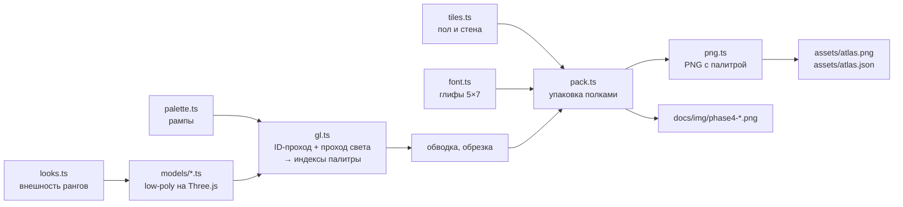

# Арт-дирекшн и пайплайн ассетов — «Конторка: Батраканы»

> Фаза 4, 29.09.2026. Основано на [`gdd.md`](gdd.md) §11 и [`architecture.md`](architecture.md) §2.4–2.5.
> Превью: [`img/phase4-sheet.png`](img/phase4-sheet.png) (все ранги и предметы), [`img/phase4-anims.png`](img/phase4-anims.png) (раскадровка анимаций), [`img/phase4-office.png`](img/phase4-office.png) (анимированный офис, APNG — открывать в Chrome или Firefox).

---

## 1. Визуальный стиль

**Суть:** low-poly 3D начала 2000-х, как в роликах мема, но «чистое» и читаемое на телефоне. Модели — простые примитивы с плоскими гранями. Каждый пиксель окрашен строго оттенком своего материала, на переходах света стоит ретро-дизеринг, вокруг всех объектов тёмная обводка в 1 px.

**Почему это выглядит «не дёшево»**, хотя сделано без художника:

1. **Рендер по ID материалов.** Обычная квантизация «к ближайшему цвету палитры» даёт грязь: тёмный синий пиджак превращается в чёрный. У нас каждый кадр рендерится дважды: сначала «какой материал в пикселе», потом «насколько он освещён». Оттенок выбирается **только из рампы этого материала**. Пиджак остаётся пиджаком в любой тени.
2. **Рампы из 4 оттенков** подобраны вручную, со сдвигом тени в холодное и света в тёплое. Так делают пиксель-художники, и поэтому картинка не выглядит «компьютерной».
3. **Упорядоченный дизеринг Байера 4×4** на границах света. Это узнаваемая фактура игр начала 2000-х, и она прямо отсылает к эстетике мема.
4. **Обводка 1 px** цветом `#1c1620`. Силуэт читается на любом фоне и на любом размере экрана.
5. **Одна камера и один свет** для всех объектов (сверху 32°, сбоку 20°, свет слева-спереди). Всё выглядит частью одного мира.

### 1.1. Палитра

90 цветов: прозрачный, обводка и 22 рампы по 4 оттенка. Файл — [`src/data/palette.ts`](../src/data/palette.ts).

| Группа | Рампы |
|---|---|
| Окружение | paper, wall, carpet, wood, cardboard, plastic, crt, steel, glass |
| Батраканы | chitin, shirt, fabric |
| Одежда по рангам | slate, blue, teal, olive, navy, red, green, burgundy, gold |
| Акценты | lime (дебик, слизь слоповины) |

Настроение — «старый офис под люминесцентными лампами»: тёплый бежевый, серо-зелёный ковролин, деревянные столы, бежевый пластик ЭЛТ-мониторов. Насыщенные цвета оставлены только для игровых сигналов: ранги, премия, дебик, колба.

### 1.2. Батраканы: силуэты и читаемость

**Наш собственный дизайн**, не копия моделей ООО «Слоп»:

- безликая голова из хитина со светлой «маской» вместо лица;
- тараканьи усики — главная визуальная шутка и живой элемент анимации;
- офисная одежда, кресло на колёсиках.

Пропорции «чиби»: голова крупнее обычной в 1.32 раза. На маленьком экране она читается, и это просто смешнее.

**Правило читаемости рангов:** соседние ранги отличаются **силуэтом**, а не только цветом. Цифра ранга будет рисоваться поверх в игре, но опознание «с одного взгляда» должно работать и без неё.

| Ранг | Отличие силуэта | Цвет |
|---:|---|---|
| 1 Стажёр | красная кепка задом наперёд, бейджик | белая рубашка |
| 2 Батракан | галстук | серый галстук |
| 3 Старший | + очки | синий галстук |
| 4 Ведущий | + жилет | оливковый жилет |
| 5 Главный | + пиджак | серый пиджак, красный галстук |
| 6 Зам начальника | + гарнитура с микрофоном | тёмно-синий пиджак |
| 7 Начальник отдела | + высокое кожаное кресло, золотые очки | чёрный пиджак, золотой галстук |
| 8 Зам по циферкам | + зелёный козырёк бухгалтера | бирюзовый пиджак |
| 9 Директор | + кресло-трон с золотой рамой, золотое перо | бордовый пиджак |
| 10 Приближённый к Хозяину | + нимб | золотой костюм |

Батракан слегка растёт с рангом (×0.90 → ×1.08). Лестница читается даже в потоке.

### 1.3. Анимации

| Анимация | Кадров | FPS | Зачем |
|---|---:|---:|---|
| `idle` | 4 | 5 | дыхание, покачивание головы и усиков — офис «живой» даже без действий |
| `work` | 6 | 12 | **основное действие**: руки попеременно колупают клавиатуру, голова кивает, усики дёргаются |
| `joy` | 4 | 8 | **успех**: руки вверх, прыжок, усики торчком (повышение, премия, шабашка выполнена) |
| `sad` | 4 | 5 | **провал**: сгорбился, голова вниз, усики поникли (шабашка провалена) |

Всплывание при найме, «поп» при слиянии, тряска, штамп «ПОВЫШЕНИЕ!» и частицы делаются в рантайме (Фазы 5–6). Кадры на них не тратятся.

### 1.4. Остальные ассеты

| Ассет | Кадров | Роль |
|---|---:|---|
| `desk` | 1 | стол: ЭЛТ-монитор спиной к камере, клавиатура, бумаги, калькулятор бухгалтера, красная кружка |
| `desk_locked` | 1 | ещё не купленный стол: коробки и скотч |
| `debik_run` | 4 | дебик — лаймовый жучок с кукишем на спине, трёхопорная походка насекомого |
| `kukish`, `icon_kukish` | 1 + 1 | валюта: сухая шишечка (частица и иконка) |
| `note` | 4 | записка Хозяина с красной сургучной печатью, трепещет в полёте |
| `envelope` | 1 | конверт премии с золотой печатью |
| `coloid` | 4 | калоидный ускоритель: колба с зелёной жижей, пузыри |
| `slop` | 1 | слоповина: ведро с мятыми бумажками и потёками слизи |
| `icon_hire`, `icon_cards`, `icon_board`, `icon_settings` | по 1 | иконки кнопок: найм, картотека, доска почёта, настройки |
| `floor_carpet`, `wall_panel` | 1 + 1 | бесшовные тайлы ковролина и стеновых панелей |
| `font_gold_*`, `font_green_*` | 2 × 28 | пиксельный шрифт 5×7 для всплывающих чисел («+12,4 тыс.», «+1.2K»): цифры, знаки и буквы компактной нотации ru/en |

Текста внутри картинок нет. Весь текст интерфейса и штампы идут через словари i18n в DOM.

---

## 2. Звук

Всё синтезируется WebAudio по рецептам в коде, файлов в сборке 0 байт (обоснование — architecture §9).

| Эффект | Когда звучит | Как устроен |
|---|---|---|
| `tap` | тап по батракану | клац клавиши: шум + короткий квадратный щелчок |
| `kukish` | падает кукиш | сухой деревянный «ток» |
| `hire` | найм | шорох бумаг + звоночек |
| `merge` | слияние | удар печати + восходящее арпеджио |
| `rankUp` | новый ранг впервые | квадратная фанфара с аккордом |
| `debik` / `debikCatch` | дебик пробежал / пойман | писк «деб!» / «плинь» с кукишами |
| `note` | записка падает | шелест бумаги со свистом |
| `bonus` | премия выплачена | «медная» фанфара |
| `coloid` | калоидный ускоритель | бульканье |
| `trash` | слоповина | мнётся бумага, звякает ведро |
| `deny` | нельзя | зуммер |
| `click` | кнопка | тик |
| `success` / `fail` | шабашка выполнена / провалена | арпеджио / грустный тромбон |

**Музыка:** бодрый «офисный MIDI» в духе игр начала 2000-х. 8 тактов, 118 BPM, до мажор, гармония C–Am–F–G. Квадратная мелодия с вибрато, треугольный «шагающий» бас, аккорды на слабые доли («офисный ска»), драм-машина. Луп ~16.3 с играет бесшовно.

Шум детерминированный (свой генератор случайных чисел), поэтому звук одинаков на всех устройствах. Послушать — `bun run audio:preview`, WAV появятся в `.cache/audio-preview/`.

---

## 3. Пайплайн

- **Одна команда:** `bun run assets`. Скрипт бандлит страницу-генератор, запускает headless Chromium (Playwright 1.56.1 + Chromium ревизии 1194), страница строит модели, рендерит кадры в два прохода, красит пиксели по рампам, добавляет обводку, обрезает поля, упаковывает атлас и возвращает индексы. Скрипт кодирует PNG и пишет JSON.
- **Детерминизм:** нет `Math.random`, свет и камера фиксированы, версия Chromium закреплена. Проверено: два прогона подряд дают побайтно одинаковые `atlas.png` и `atlas.json` (sha256 совпадают).
- **Защита от ошибок:** если спрайт упирается в край кадра, генерация падает с именем спрайта. Так уже поймали три реальных обрезания: нимб ранга 10, коробку у закрытого стола, поднятые руки ранга 9.
- **Формат `atlas.json`:** `frames[name] = [x, y, w, h, ax, ay]`, где `ax, ay` — якорь (точка на полу под центром стола) внутри обрезанного кадра. Все спрайты персонажей и стол отрендерены одной камерой с общим якорем. В игре батракан и стол рисуются в одну точку и совпадают попиксельно. Стол при рендере батракана служит невидимой маской: то, что им закрыто, уже вырезано из кадров батракана. Порядок отрисовки: сначала стол, потом батракан.
- **Анимации:** `anims[name] = { frames, fps, loop }`, имена `b{ранг}_{idle|work|joy|sad}`, `debik_run`, `note`, `coloid`.
- **Почему свой PNG-кодировщик:** браузер и стандартные библиотеки пишут полноцветный RGBA (4 байта на пиксель). У нас 90 цветов, и палитровый PNG хранит 1 байт на пиксель. Кодировщик — ~150 строк с тестами, включая анимированный APNG для превью.

### 3.1. Зачем на Windows нужен Chromium

Генератор рендерит 3D в браузере. Один раз выполни `bunx playwright install chromium` — поставится ровно та ревизия, под которую закреплён Playwright. Для сборки игры Chromium не нужен: атлас лежит в репозитории.

---

## 4. Вес

| Файл | Размер | gzip | Доля бюджета 2.5 МБ |
|---|---:|---:|---:|
| `assets/atlas.png` (2040×940, 90 цветов, 260 кадров) | 163.5 КБ | 162.5 КБ | 6.5% |
| `assets/atlas.json` | 13.0 КБ | 3.2 КБ | 0.1% |
| Звук и музыка | 0 (синтез в коде) | — | — |
| **Итого ассеты** | | **~166 КБ** | **~6.6%** |

PNG уже сжат deflate, поэтому gzip его почти не уменьшает. Запас бюджета огромный: даже ×3 контента (новые отделы) уложится.

Время генерации — ~3 с на 260 кадров (программный WebGL в контейнере). На машине с GPU быстрее.

---

## 5. Как проверить

- `bun run assets` → смотреть `docs/img/phase4-sheet.png` и `phase4-anims.png`.
- `bun run audio:preview` → слушать `.cache/audio-preview/sfx-all.wav` и `music_*.wav`.
- В Фазе 5 это же увидим в игре на телефоне, в реальном масштабе.
