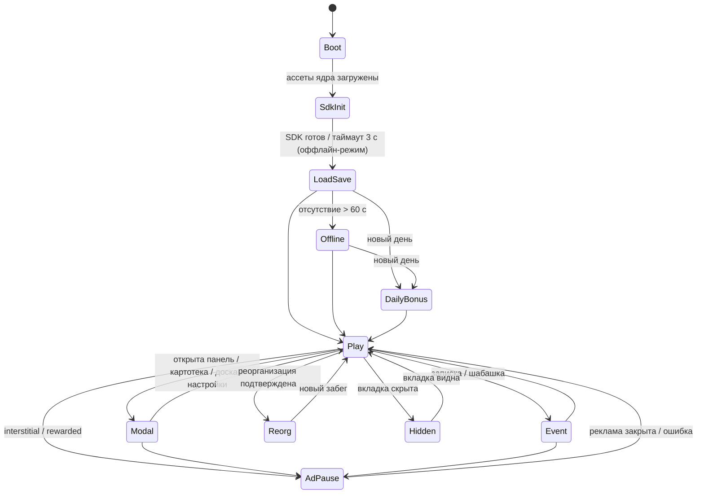

# GDD — «Конторка: Батраканы»

> **Версия 0.2, 07.10.2026 — «Вертикаль Конторки».** После плейтеста среза (игра проходилась меньше чем за 10 минут) заказчик выбрал направление A из [`progression.md`](progression.md). Раздел 0 ниже — действующая спецификация. Там, где он расходится с разделами 1–13 (версия 0.1), прав раздел 0. Устаревшие места помечены «⚠️ заменено в v0.2».

---

## 0. v0.2 — «Вертикаль Конторки»

### 0.1. Решения заказчика (07.10.2026)

| Вопрос | Решение |
|---|---|
| Направление | A «Вертикаль Конторки»: этажи-отделы до кабинета Хозяина + реорганизация + смены и поручения |
| Объём к модерации | 3 этажа, отправка ~24–27.10.2026 |
| Персонажи оригинала | **с именами**: секретарша **Тося Бося**, **Кудесница Алеся** из отдела квадров. Риск по правам принят заказчиком осознанно. Внешность персонажей — наш собственный дизайн. |
| Конкуренты на Yandex Games | по проверке заказчика 07.10 — ни одной «Конторки» нет |

### 0.2. Здание

Конторка — здание, игрок поднимается снизу вверх. Каждый этаж — отдел со своей линейкой из 10 рангов, своей внешностью батраканов, столами, полом и «чем колупают».

| Этаж | Отдел | Что колупают | Статус |
|---:|---|---|---|
| 1 | Бухгалтерия | циферки | релиз |
| 2 | Склад | коробки | релиз |
| 3 | Конторка дизайнеров | макеты | релиз |
| 4–6 | СММ-конторка, Врачильная, IT-отдел | лайки, справки, баги | обновления после релиза |
| 7 | Приёмная (Тося Бося) | — | обновление |
| 8 | Кабинет Хозяина | — | финальное событие, к релизу «Хозяин занят» |

- Этажи работают **одновременно**: доход идёт со всех открытых этажей, даже когда игрок смотрит на другой.
- Между этажами — **лифт** (переключатель этажей). Закрытый этаж показывает цену открытия.
- Валюта одна — **кукиши**. Каждый следующий этаж даёт на порядки больше дохода и на порядки дороже.

### 0.3. Экономика v2

Причина ремонта — [`progression.md` §1](progression.md): уровень найма рос сам, удорожание сбрасывалось, стоков не было.

| Величина | Формула (константы — `src/data/balance.ts`, подбирает симулятор) |
|---|---|
| Доход батракана ранга r на этаже f | `incomeBase · floorIncome[f] · incomeRankMult^(r−1) · оснащение(f) · M` |
| Общий множитель M | `(1 + выслуга·seniorityBonus) · картотека · премированный ×2 · баффы` |
| Найм на этаже f | нанимается ранг `q` — **квалификация найма этажа** (покупается). Цена: `hireBase · floorCost[f] · 2^(q−1) · hireGrowth^U`, где `U` — сколько «единиц» (батраканов ранга 1 в пересчёте) уже нанято на этаже в этом забеге. **Счётчик не сбрасывается** при повышении квалификации. |
| Квалификация найма | уровень `q` от 1 до 7, цена растёт экспоненциально. Сток кукишей. |
| Оснащение этажа | уровни мониторов, кресел и калькуляторов: `+50%` дохода этажа за уровень, цена ×`equipMult` за уровень. Сток кукишей. |
| Столы | старт 8, докупаются до 12 на каждом этаже, цена ×`deskMult` за стол. |
| Открытие этажа | разовая цена `floorUnlock[f]`, этаж остаётся открытым навсегда, в том числе после реорганизации. |
| Тап | `max(1, tapFraction · доход в секунду)` |

Инварианты закреплены тестами: слияние всегда повышает доход (`incomeRankMult > 2`); цены растут монотонно; ни одна покупка не может сделать кукиши отрицательными.

### 0.4. Реорганизация и отдел квадров

- **Реорганизация** доступна, когда выслуга за забег ≥ 1: `выслуга = floor(sqrt(заработано за забег / reorgBase))`.
- **Сбрасывается:** кукиши, батраканы, квалификация, оснащение, докупленные столы, удорожание найма.
- **Остаётся:** открытые этажи, выслуга, печати, перки, картотека, поручения, серия аванса, туториал.
- Выслуга даёт **две вещи сразу**: постоянный бонус дохода `+seniorityBonus` за каждое очко (не тратится) и столько же **печатей отдела квадров** — валюты перков. Так бонус никогда не уменьшается от покупок, и детям не надо выбирать «бонус или перк».
- **Перки Кудесницы Алеси** (за печати, с уровнями): квалификация с порога, лишний стол на всех этажах, длинный отгул, дебики чаще, жирная премия, автослияние, бережливость (−5% цены найма за уровень).

### 0.5. Ритм: смена, день

| Слой | Механика |
|---|---|
| **Смена** (5–10 мин) | один понятный план («наколупай N», «слей K», «найми M», «поймай дебика»), прогресс-бар сверху. Выполнил — модалка **«Смена отшабашена!»**: премия (настоящая) + «×2 за рекламу» + следующий план. Естественная точка для interstitial. |
| **Поручения Тоси Боси** | 3 задания в день из пула, цели масштабируются под текущий прогресс. Каждое даёт кукиши, все три — **+1 печать**. Сбрасываются в полночь по времени устройства (сервер — в Фазе 7). |
| **Аванс** | награда за вход раз в день, серия до 7 дней. |
| **Отгул** | оффлайн-доход 50% до 2 часов (перк продлевает), «×2 за рекламу». |

### 0.6. События на этаже

| Событие | Частота | Суть |
|---|---|---|
| Записка Хозяина | 90–150 с | аврал (×3 на 30 с), шабашка (N тапов за 20 с), подарок сверху |
| Дебик | 45–90 с | пробегает по этажу, тап → кукиши |
| **Кредик** | ~4 мин | предлагает заём: «+10 минут дохода сейчас»; возврат — 30% всех выплат, пока не вернёшь ×1.5. Можно отказаться. |
| **Проверка сверху** | ~10 мин | вызов на 60 с: «наколупай X». Успел — тройная премия, не успел — ничего не теряешь. Отсылка к «тихим сокращениям» без наказания. |

### 0.7. Картотека и премированные батраканы

- Картотека: 10 рангов × 3 этажа = 30 карточек. Каждая открытая карточка — `+2%` дохода её этажа.
- **Премированный батракан:** с шансом 1% при найме или слиянии батракан выходит «премированным» (золотое свечение, искры, доход ×2). Премированность сохраняется при слиянии. Своя карточка на каждый ранг → ещё 30 карточек «★».

### 0.8. Реклама (уточняет §7)

Rewarded: премия (конверт), калоидный ускоритель, найм по блату, «×2 отгул», **«×2 премия смены»**. Interstitial: после «Смена отшабашена!», после реорганизации, при закрытии отгула. Ограничитель частоты (`core/ad-guard`) из §7 остаётся.

### 0.9. MVP к модерации (заменяет §10)

3 этажа с лифтом · экономика v2 и симулятор с тестами темпа · реорганизация и 7 перков · квалификация, оснащение, столы · смена, поручения, аванс, отгул · записки, дебики, кредики, проверка сверху · картотека с премированными · Тося Бося и Кудесница Алеся · реклама и SDK (Фаза 7).

**После релиза:** этажи 4–6, приёмная, событие «Кабинет Хозяина», городские ремиксы, доска почёта по сезонам.

### 0.10. Целевой темп

См. [`progression.md` §5.2](progression.md). Темп проверяет симулятор `bun run balance` (`scripts/balance/`) — бот играет на настоящем `src/core` — и тест `scripts/balance/balance.test.ts` в `bun test`.

**Результат подгонки (08.10.2026), бот — внимательный активный игрок, 2 тапа/с:**

| Веха | Бот | Цель |
|---|---:|---:|
| Ранг 10 Бухгалтерии | 1.0 ч | 35 мин – 1.2 ч |
| Первая реорганизация | 1.5 ч | 1.3 – 3 ч |
| Открыт Склад | 3.3 ч | 2 – 4 ч |
| Открыта Конторка дизайнеров | 8.8 ч | 5 – 10 ч |
| Вся картотека (30) | 14.5 ч | 12 – 26 ч |

Реорганизаций за это время — 13. По пути симулятор поймал три ошибки дизайна, которые не видны в юнит-тестах:
1. **Удорожание «за единицу ранга»** (найм ранга 5 считался за 16 наймов) давало быстрый старт и затем стену на 3 часа. Теперь удорожание считается за каждый найм.
2. **Картотеку нельзя было собрать:** перк «квалификация с порога» пропускал младшие ранги на новых этажах. Теперь достигнутый ранг открывает и все младшие карточки.
3. **Выслуга по корню** разгонялась после открытия этажей (доход ×400 за этаж). Теперь используется кубический корень (`reorgExp = 0.33`).

Чтобы первый найм оставался делом секунд при новой цене найма (80), на старте забега выдаются «подъёмные» — 75 кукишей.

---

> Ниже — версия 0.1 от 29.09.2026 (история решений).
>
> Версия 0.1, 29.09.2026. Выбранный концепт — K ([`concepts.md`](concepts.md)), досье мема — [`market-research.md` §10](market-research.md).
> Рабочее название: **ru** «Конторка: Батраканы», **en** «Kontorka: Workroaches».
> Жанр: idle-кликер с merge. Платформа: Yandex Games, мобильный портрет в приоритете, десктоп вторичен.
> Все числа экономики ниже стартовые. В Фазе 6 их подгоняет скрипт-симулятор, а юнит-тесты фиксируют инварианты.

---

## 1. Суть в одном абзаце

Ты руководишь отделом в Конторке. Батраканы сидят за столами и колупают циферки, за это капают кукиши. На кукиши в отделе квадров нанимаются новые батраканы. Двух одинаковых можно слить в одного рангом выше: это повышение, и доход растёт. Сверху время от времени падают записки Хозяина с авралами и шабашками, по офису пробегают дебики с бонусами, а премию Хозяин обещает, но выплачивает только после просмотра рекламы. Когда отдел дорастает до начальника, можно устроить реорганизацию: всё сбрасывается, а выслуга навсегда увеличивает доход.

---

## 2. Кор-луп по секундам (первая сессия)

| Время | Что видит и делает игрок | Цель дизайна |
|---|---|---|
| 0–2 с | Короткий лоадер «Конторка открывается…». | Время до интерактива ≤ 3 с на среднем Android + 4G. |
| 2–4 с | Сразу офис: один **стажёр-батракан** за столом, над ним анимированная рука с подписью «Колупай циферки!». Тап → из-под пальца вылетают циферки, звенит «+1 кукиш». | Первое действие без меню и текста. Узнаваемость мема в первом кадре. |
| 4–8 с | Набралось 5 кукишей, кнопка **«Отдел квадров»** пульсирует. Тап → за соседним столом появляется второй стажёр. | Первая покупка и понимание, зачем нужна валюта. |
| 8–12 с | Рука показывает перетаскивание одного стажёра на другого. Бросаешь → **штамп «ПОВЫШЕНИЕ!»**, тряска, конфетти из бумажек, на столе **Батракан** (ранг 2). В картотеке открывается первая карточка. | Первый «вау»-момент до 15 с. Подсказки на этом заканчиваются. |
| 12–60 с | Свободная игра: тапаешь, нанимаешь, сливаешь. Столы заполняются, приходится решать, кого сливать. | Кор-луп закреплён, игрок принимает первые решения. |
| ~45 с | По полу пробегает первый **Дебик**. Тап → куча кукишей. | Сюрприз, вознаграждение за внимание. |
| ~90 с | Сверху падает **Записка от Хозяина**: «Шабашка! Наколупай 40 циферок за 20 сек». | Мини-цель и смена ритма. |
| ~2–3 мин | Впервые появляется **конверт «Хозяин обещал премию»**. | Знакомство с rewarded в виде шутки, без давления. |
| ~3–5 мин | Ранги 4–5. После окончания шабашки — первая возможная точка для interstitial (см. §7). | Естественный конец эпизода. |
| ~12–20 мин (суммарно, обычно за 2–4 захода) | Ранг 7 «Начальник отдела» → открывается **Реорганизация**. | Первый prestige. Причина вернуться и начать заново сильнее. |
| Возврат через часы | Модалка **«Отгул»**: «Пока тебя не было, батраканы наколупали X кукишей» [Забрать] [Удвоить ▶]. | Удержание на D1, естественное rewarded-предложение. |

Типичная сессия длится 3–5 минут, игрок заходит несколько раз в день.

---

## 3. Сущности и правила

### 3.1. Батраканы и ранги (отдел «Бухгалтерия», MVP)

| Ранг | ru | en | Доход, кукишей/с (база) |
|---:|---|---|---:|
| 1 | Стажёр-батракан | Intern Workroach | 1 |
| 2 | Батракан | Workroach | 3 |
| 3 | Старший батракан | Senior Workroach | 9 |
| 4 | Ведущий батракан | Lead Workroach | 27 |
| 5 | Главный батракан | Chief Workroach | 81 |
| 6 | Замначальника отдела | Deputy Head | 243 |
| 7 | Начальник отдела | Head of Department | 729 |
| 8 | Заместитель по циферкам | VP of Digits | 2 187 |
| 9 | Директор Конторки | Kontorka Director | 6 561 |
| 10 | Приближённый к Хозяину | Close to the Boss | 19 683 |

- Доход ранга: `inc(r) = 3^(r−1)`. При слиянии двух батраканов ранга r получается один ранга r+1 с доходом в 1.5 раза больше пары. Поэтому сливать всегда выгодно, и это правило закрыто тестом.
- Ранг 10 максимальный, его нельзя слить дальше. Двух десятых можно только держать или сдать в слоповину.
- Батракан не просто стоит: за столом проигрывается анимация «колупания», а над ним вылетают циферки. Это визуальная обратная связь о доходе.

### 3.2. Столы (поле)

- Сетка в портрете: старт **2×4 = 8 столов**, докупается до **3×4 = 12**.
- Цена 9–12-го стола: 200 / 1 500 / 12 000 / 100 000 кукишей.
- Когда все столы заняты, кнопка найма показывает «Нет мест», а рядом подсвечивается слоповина или пара, которую можно слить.

### 3.3. Ввод

- **Тап по батракану** (смещение < 10 px и длительность < 250 мс): батракан ускоренно колупает, игрок получает `tapValue` кукишей, вылетают циферки.
- **Тап по пустому столу**: ничего не происходит, но звучит лёгкий «тук» (проверка отзывчивости).
- **Перетаскивание батракана**: на стол с таким же рангом — слияние; на пустой стол — перенос; на зону **слоповины** (урна в углу) — утилизация; на батракана другого ранга — обмен местами.
- Все тач-зоны не меньше 48 px. Десктоп: мышь работает так же, пробел — тап по случайному батракану (удобство для десктопа).

### 3.4. Отдел квадров (найм) — ⚠️ заменено в v0.2 (§0.3)

- Уровень найма: `hireLevel = max(1, maxRankReached − 3)`. Чем выше игрок продвинулся, тем старше нанимаемые батраканы, и ранних стажёров больше не приходится сливать до бесконечности.
- Цена найма: `hireCost(L, n) = 5 · 2.6^(L−1) · 1.12^n`, где `n` — сколько батраканов уровня L уже нанято в этом забеге.
- Если кукишей не хватает, появляется альтернативная кнопка **«Нанять по блату ▶»** (rewarded): бесплатный батракан уровня `hireLevel`, откат 60 с.

### 3.5. Слоповина

- Перетаскивание батракана в урну: возврат `0.25 · hireCost(r, 0)` и освобождение стола.
- Двойное подтверждение не нужно, но 3 секунды после утилизации доступна кнопка «Вернуть» (защита от случайного броска на мобиле).

---

## 4. Экономика — ⚠️ заменено в v0.2 (§0.3–0.4)

### 4.1. Валюта

| Валюта | Где берётся | На что тратится |
|---|---|---|
| **Кукиши** (мягкая) | тап, пассивный доход, события, дебики, оффлайн, аванс | найм, столы |
| **Выслуга** (prestige, не тратится) | реорганизация | ничего: работает как постоянный множитель дохода |

Жёсткой валюты и IAP в MVP нет (см. §10).

### 4.2. Формулы (стартовые)

| Величина | Формула |
|---|---|
| Пассивный доход в секунду | `income = Σ inc(r_i) · M` |
| Общий множитель | `M = (1 + 0.1 · выслуга) · buff` (buff = 2 во время премии, 3 во время аврала; баффы перемножаются) |
| Доход за тап | `tapValue = 1 + 0.15 · income` |
| Оффлайн | `offline = 0.5 · income_base · min(t_away, 2 ч)`; «Удвоить ▶» даёт ×2. Если время ушло назад (перевод часов), оффлайн = 0. |
| Выслуга за реорганизацию | `gain = floor( sqrt(earnedThisRun / 50 000) )` |
| Условие реорганизации | достигнут ранг 7, `gain ≥ 1` |
| Аванс (ежедневно) | день серии d = 1..7: `min(d, 7) · 60 с · income_base`, минимум 50 кукишей. Серия сбрасывается после пропуска дня. |

### 4.3. Баланс-цели (что проверяет симулятор в Фазе 6)

- Первое слияние за ≤ 15 с у игрока, который просто тапает.
- Ранг 4 примерно на 3-й минуте, ранг 7 — к 12–20 минутам суммарной игры.
- Второй забег после первой реорганизации до ранга 7 проходит примерно на 30% быстрее первого.
- Всегда есть «следующая покупка» не дальше 30–60 с пассивного дохода (нет мёртвых пауз).
- Rewarded ускоряет прогресс, но без него игра проходится полностью (требование Yandex к наградам — `[verify]`).

### 4.4. Инварианты для юнит-тестов

- Слияние всегда повышает доход: `inc(r+1) > 2·inc(r)`.
- Цена найма монотонно растёт по `n`.
- Оффлайн никогда не бывает отрицательным и не превышает `0.5 · income · 2 ч` без буста.
- Реорганизация не уменьшает выслугу, а картотека сохраняется.
- Сохранение → загрузка даёт идентичное состояние (round-trip).

---

## 5. События и существа

### 5.1. Записки от Хозяина

Появляются каждые 90–150 с (случайно) и падают сверху, пока ни одна модалка не открыта. Тап по записке — раскрыть. Если записку не трогать 10 с, она «уносится сквозняком».

| Записка | Эффект | Примерный текст |
|---|---|---|
| **Аврал** | ×3 к доходу на 30 с | «Хозяин велел: АВРАЛ! Колупать втрое!» |
| **Шабашка** | тапнуть N раз за 20 с (N растёт с рангом: 30 + 5·maxRank); успех = `45 · income` кукишей | «Шабашка! Наколупай 40 циферок, пока никто не видит» |
| **Подарок сверху** | сразу `30 · income` кукишей | «Хозяин передаёт кукиши. Не спрашивай откуда» |

В MVP только позитивные события. Негативные («урезали кукиши», «проверка») вынесены за MVP: сначала посмотрим, как игроки реагируют на базовые.

### 5.2. Дебики

- Появляются каждые 45–90 с, пересекают офис за ~6 с по случайной дуге.
- Тап → `20 · income` кукишей, вспышка и визг «деб!».
- Кредики (с механикой «займа») — за MVP.

### 5.3. Премия (конверт) и калоидный ускоритель — rewarded

| Точка | Где | Награда | Откат |
|---|---|---|---|
| **Премия** | конверт «Хозяин обещал премию» слева сверху | ×2 доход на 180 с | конверт появляется через 3 мин после предыдущей премии |
| **Калоидный ускоритель** | иконка-колба справа | 60 с автослияния всех пар + ×1.5 доход | 5 мин |
| **Удвоить отгул** | модалка «Отгул» | ×2 оффлайн | раз на возврат |
| **Нанять по блату** | вместо кнопки найма, когда не хватает кукишей | бесплатный батракан уровня `hireLevel` | 60 с |

Шутка с премией: без просмотра рекламы при тапе показывается «Обещание принято к сведению ✍️». После просмотра звучит фанфара и «Премию выплатили. Впервые в истории Конторки».

---

## 6. Прогрессия и мета — ⚠️ заменено в v0.2 (§0.2–0.7)

1. **Внутри забега:** ранги 1 → 10, число столов, уровень найма.
2. **Картотека отдела квадров** (коллекция): 10 карточек рангов с low-poly портретом, названием и шуточным «личным делом» из одной строки. Пока ранг не открыт, в карточке виден силуэт и «???».
3. **Реорганизация** (prestige): выслуга → постоянный множитель. Заставка «Конторку реорганизовали. Батраканы те же, таблички новые».
4. **Доска почёта** (лидерборд Yandex): метрика — **суммарная выслуга** (целое число, растёт медленно, переполнения нет). Ограничения на значение score — `[verify]`.
5. **Аванс** (ежедневная награда, серия 7 дней).
6. **После MVP — отделы:** Склад, IT-отдел, Курьерская и т.д. У каждого своя линейка рангов и модели. Отдел добавляется конфигом и прогоном скрипта рендера, код не меняется. Выходят обновлениями под текущие тренды и ремиксы мема.

---

## 7. Монетизация и частота рекламы

- **Rewarded** — только по инициативе игрока, 4 точки из §5.3. Награда всегда дополнительная, прогресс без неё не блокируется.
- **Interstitial** — только в естественных паузах:
  1. после экрана результата шабашки;
  2. после реорганизации (перед новым забегом);
  3. при закрытии модалки «Отгул» (если не было rewarded «Удвоить»).
- Собственный ограничитель поверх контроля Yandex: не раньше 60 с от старта сессии, не чаще раза в 120 с, не во время перетаскивания и не в течение 3 с после тапа. Точные лимиты платформы сверяем в документации и консоли — `[verify]`.
- Во время любой полноэкранной рекламы: пауза игрового цикла, таймеров событий и баффов, заглушение музыки и звуков. После рекламы всё восстанавливается.
- Если SDK недоступен, реклама не показывается. Rewarded-кнопки в этом случае скрыты, а не «ломаются».

---

## 8. Экраны и UI

Портрет 9:16 основной. На десктопе игра занимает центральную колонку, по бокам декоративный офисный фон.

```
┌──────────────────────────────┐
│ 🌰 12.4K   +320/с      ⚙️    │ ← верхняя панель: кукиши, доход, настройки
│ [✉️ Премия]       [🧪 Калоид] │ ← rewarded-иконки (когда доступны)
│                              │
│   [стол][стол][стол]         │
│   [стол][стол][стол]         │ ← поле 2×4 → 3×4
│   [стол][стол][стол]         │
│   [стол][стол][стол]  🗑️     │ ← слоповина
│                              │
│ [📇 Картотека] [🏆 Доска]    │
│ [   🧾 НАНЯТЬ БАТРАКАНА 5🌰 ] │ ← главная кнопка, большая, внизу под большим пальцем
└──────────────────────────────┘
```

| Экран / оверлей | Содержание |
|---|---|
| **Лоадер** | фон Конторки, полоса прогресса, фраза из словаря |
| **Офис** (основной) | поле, верхняя и нижняя панели, всплывающие записки, дебики, конверт |
| **Отдел квадров** (нижняя панель-выезд) | найм, покупка стола, «Нанять по блату ▶» |
| **Картотека** | сетка 10 карточек, прогресс «7/10» |
| **Доска почёта** | топ из лидерборда Yandex и своя позиция. Без SDK: «Доска почёта временно на ремонте» |
| **Реорганизация** | сколько выслуги получишь, что сбросится, что сохранится; кнопки [Реорганизовать] [Позже] |
| **Отгул** | сумма оффлайна, [Забрать] [Удвоить ▶] |
| **Аванс** | 7 кружков серии, [Забрать] |
| **Настройки** | музыка, звуки, язык (ru/en), ссылок нет |
| **Пауза-оверлей** | затемнение во время рекламы или при потере фокуса вкладки |

Все строки UI берутся из словаря `ru`/`en`, хардкода текста нет. Числа форматируются через локаль: `12.4K` / `12,4 тыс.`, суффиксы тоже в словаре.

---

## 9. Состояния игры



- `AdPause` и `Hidden` полностью останавливают симуляцию и звук. Игровые таймеры считаются по «игровому» времени, а не по часам.
- Автосохранение: каждые 15 с, при уходе вкладки в фон, после покупок, слияний и реорганизации. Сохранения идут в облако через SDK и дублируются в `localStorage`. При конфликте берётся версия с бо́льшим `totalEarned`.

---

## 10. MVP: что входит и что осознанно вырезано — ⚠️ заменено в v0.2 (§0.9)

**Входит (цель — отправка на модерацию примерно через 3 недели):**
- Отдел «Бухгалтерия»: 10 рангов, свои модели и анимации (idle, колупание, повышение, радость и огорчение).
- Тап, найм, слияние, перенос, слоповина, 8→12 столов.
- Записки Хозяина (3 типа), дебики.
- Rewarded: премия, калоидный ускоритель, удвоение отгула, найм по блату.
- Interstitial в 3 естественных точках.
- Реорганизация + выслуга, картотека, доска почёта, аванс, оффлайн.
- Облачные и локальные сохранения, оффлайн-устойчивость, ru/en.
- Процедурные звуки и музыкальный луп.

**Осознанно вырезано (после релиза, по метрикам):**

| Вырезано | Почему | Когда вернуть |
|---|---|---|
| Другие отделы (Склад, IT, Курьерская) | главный объём контента; архитектура уже готова к ним | первое обновление через 1–2 недели после релиза |
| Негативные события, кредики с «займом» | риск раздражения; сначала база | по реакции игроков |
| Кудесница Алеся как NPC с диалогами | объём текста и визуала | с отделами |
| Квесты, достижения | не критичны для первого удержания | после D1-метрик |
| IAP / жёсткая валюта | ставка на рекламу, узкая аудитория IAP | если ARPDAU будет низким |
| Асинхронный онлайн и сервер на Go | риск модерации и объём | отдельным этапом после релиза |
| Локализация tr | ru/en по решению заказчика | архитектура словаря готова |
| Озвучка | нечем генерировать качественно без внешних сервисов | не планируется |

---

## 11. Визуальное и звуковое направление (детали — в Фазе 4)

- **Стиль:** low-poly 3D начала 2000-х, как в роликах мема. Плоский шейдинг, небольшие текстуры, цветовая палитра старого офиса (бежевый, серо-зелёный, свет люминесцентных ламп), лёгкий дизеринг.
- **Батраканы — наш собственный дизайн**, не копия моделей ООО «Слоп»: безликая фигура (в лоре батраканы безликие), тараканьи усики как наша визуальная шутка, ранги различаются аксессуарами (галстук, очки, кружка, бейдж, кресло, нимб у «Приближённого»).
- **Пайплайн:** параметры ранга в JSON → headless Blender-скрипт строит модель и рендерит кадры → спрайт-атлас. Одна команда из `scripts/`.
- **Звук:** синтез скриптом — клацанье клавиатуры, штамп, звон кукишей, «деб!», фанфара премии, бодрый MIDI-луп в духе 2000-х.

---

## 12. Метрики успеха

Цели наши собственные (бенчмарков платформы в открытом доступе не нашли). После релиза сверяем с аналитикой консоли.

| Метрика | Цель MVP | Как проверяем |
|---|---|---|
| Размер первой загрузки | ≤ 2.5 МБ (gzip) | CI-проверка бюджета сборки |
| Время до интерактива | ≤ 3 с (Android среднего уровня, 4G-троттлинг) | Lighthouse / Chrome DevTools на троттлинге |
| FPS | ≥ 55 на среднем Android | профилирование на устройстве |
| Первое слияние | ≥ 80% новых игроков за 15 с | консоль / плейтест |
| Длина сессии | ≥ 4 мин в среднем | консоль Yandex |
| D1 retention | ≥ 20% | консоль Yandex |
| Просмотры rewarded на DAU | ≥ 1.5 | консоль Yandex |
| Ошибки и падения | 0 фатальных сценариев без SDK и без сети | тест-матрица Фазы 7 |

---

## 13. Открытые вопросы (не блокируют Фазу 3)

- Точные лимиты interstitial и допустимые значения score лидерборда — сверить в документации и консоли (Фаза 7).
- Проходит ли модерацию слово «Конторка» в названии — проверим на первой отправке, запасной вариант «Батраканы: Офисный idle».
- Показывает ли Yandex рекламу на старте игры сам — выяснить, чтобы наш первый interstitial не получился вторым подряд `[verify]`.
