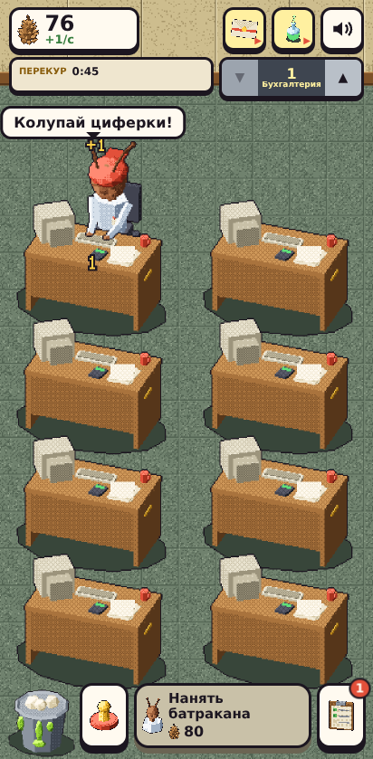
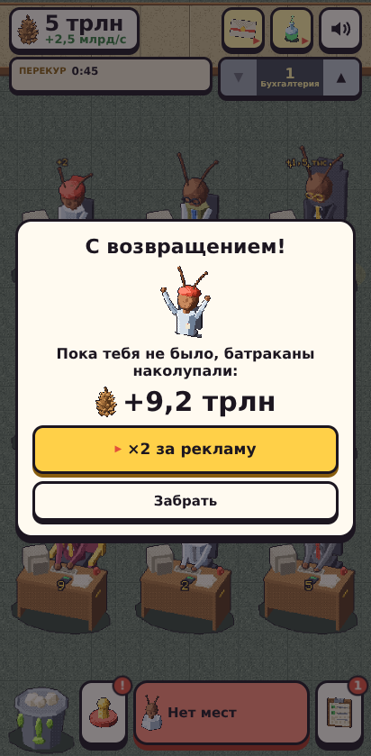
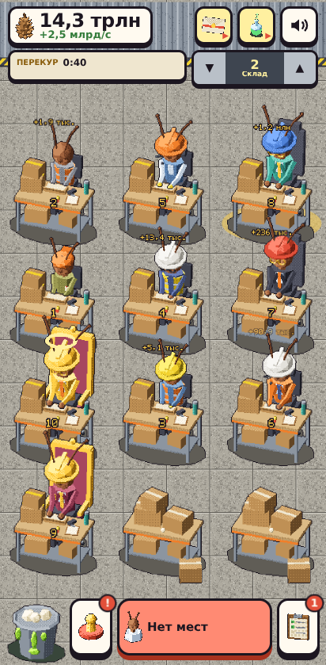
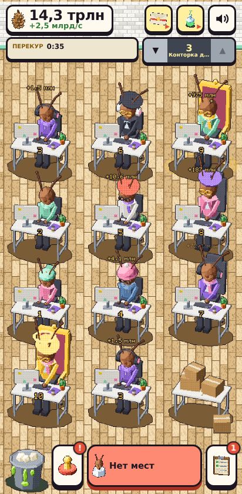
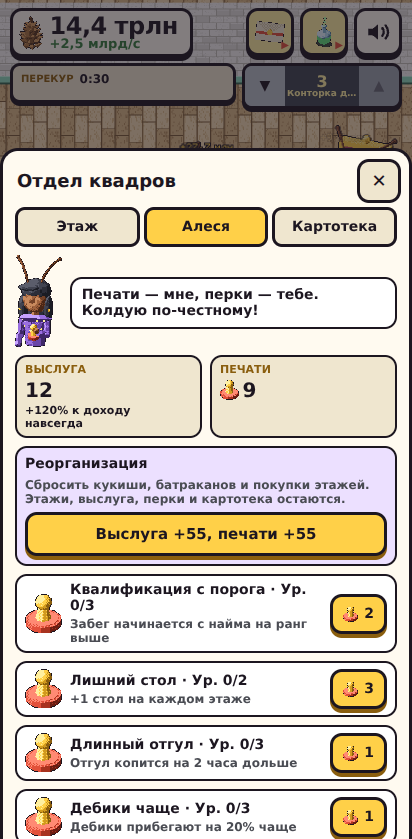
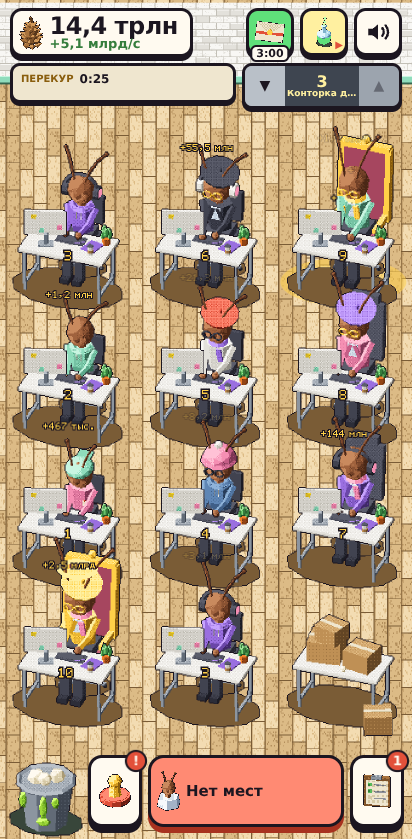
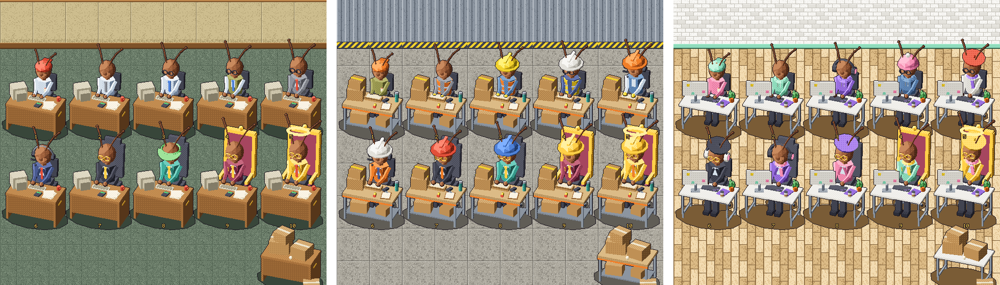
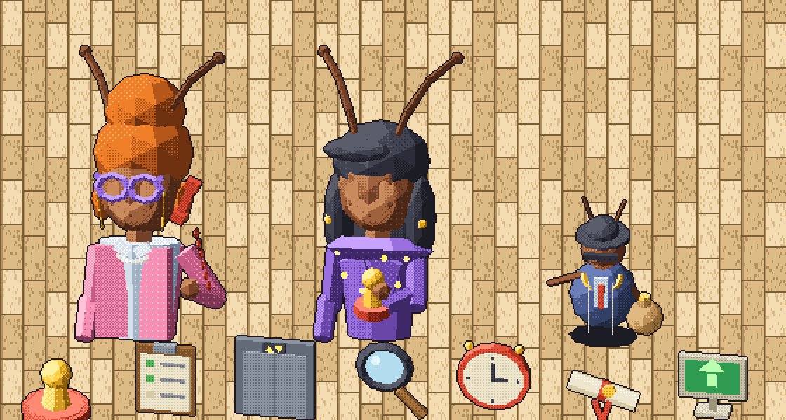

# Фаза 6 — «Вертикаль Конторки»: контент, экономика, события, интерфейс

> Итог Фазы 6 (07.10.2026). Спецификация — [`gdd.md` §0](gdd.md), причины — [`progression.md`](progression.md). Дальше — Фаза 7 (Yandex SDK), после «дальше».

## 1. Что сделано

| Блок | Результат |
|---|---|
| Экономика v2 (M3a) | 3 этажа с общим доходом, квалификация найма, оснащение, докупка столов, открытие этажей, реорганизация с выслугой и печатями, 7 перков Кудесницы Алеси, картотека 30 + 30 ★. Сохранение v2 с миграцией из среза. |
| Симулятор баланса | Бот играет на настоящем `src/core` 40 часов игры за ~0,6 с. `bun run balance` печатает вехи, `bun test` держит темп в целевых коридорах. Поймал 4 ошибки дизайна (см. GDD §0.6 и §0.10). |
| События и дневные слои (M3b) | Записки Хозяина (аврал, шабашка, подарок), дебики, кредики с займом и гашением долей выплат, проверка сверху, баффы (премия, аврал, калоид с автослиянием), план смены с перекуром, 3 поручения Тоси Боси в день + печать за все, аванс с серией до 7 дней, отгул. Всё детерминировано и под тестами, слой событий сохраняется (битый — не губит прогресс). |
| Ограничитель рекламы | `core/ad-guard`: межстраничная — не раньше 60 с от старта, не чаще 120 с, не во время драга и не в течение 3 с после тапа. Rewarded — только по кнопке игрока и не во время драга. |
| Ассеты (6.5) | Линейки рангов Склада (сигнальные жилеты, каски) и Конторки дизайнеров (худи, шапки, береты, наушники), свои столы, полы и стены; портреты **Тоси Боси** и **Кудесницы Алеси**, кредик, 7 новых иконок, глифы чисел до секстиллионов. Палитра +9 рамп. |
| Ленивая загрузка | Атлас разбит на 3 листа: общий + Бухгалтерия грузится сразу, листы Склада и дизайнеров — при поездке на лифте (или в фоне, если этаж уже открыт). Стартовая загрузка выросла всего на ~20 КБ. |
| Интерфейс (6.6) | HUD в две строки (деньги, премия и калоид за рекламу, звук; план смены и лифт), закрытый этаж с ценой, отдел квадров (этаж / Алеся / картотека), поручения и аванс, модалки (смена, отгул, аванс, реорганизация, премия, калоид), пузырь кредика, испытания шабашки и проверки, бейджи. Найм «по блату» за рекламу, когда не хватает кукишей. |
| Платформа | `showRewarded` / `showInterstitial` в интерфейсе `Platform`. Локально — **имитация рекламы** (чёрный экран «Реклама (имитация)» на 1,8 с), во фрейме без SDK реклама «недоступна». На время показа игра, звук и геймплей платформы на паузе (`game/ads.ts`). |
| Тесты и смоук | 119 юнит-тестов (было 93 в начале фазы). Смоук: 18 проверок, включая позднюю игру — отгул, аванс, лифт с ленивой загрузкой Склада, перки Алеси, премию после рекламы. |

## 2. Цифры

| Метрика | Срез (Фаза 5) | Фаза 6 | Бюджет |
|---|---:|---:|---:|
| Сборка, gzip | 188 КБ | 572 КБ (из них 3 листа атласа по ~174 КБ) | 2500 КБ |
| Что грузится на старте | 188 КБ | ~210 КБ (JS + CSS + общий лист) | — |
| Время до интерактива, slow 4G + CPU×4 | 1,8 с | 2,4 с | ≤ 3 с |
| Кадров в атласе | 260 | 643 | — |
| Темп: ранг 10 Бухгалтерии / Склад / дизайнеры / вся картотека | 12 с / — / — / — | 48 мин / 2,5 ч / 5,7 ч / 14,6 ч | GDD §0.10 |

## 3. Как проверить

1. `bun run dev` → `http://localhost:5173` (с телефона — `http://<IP-компьютера>:5173`). Реклама на локальном запуске — имитация.
2. Пройди первые 10 минут как новый игрок: подсказки, первая смена (после перекура 45 с), первые записки и дебики.
3. Чтобы посмотреть позднюю игру без 5 часов игры, в консоли браузера можно подложить сохранение из смоука или просто открыть скриншоты ниже.

**Чек-лист плейтеста:**

- [ ] Записка Хозяина заметна и понятна; аврал/подарок/шабашка ощущаются наградой.
- [ ] Дебика удаётся поймать пальцем; тост с наградой виден.
- [ ] Предложение кредика понятно (заём сейчас — долг из выплат), отказ не раздражает.
- [ ] План смены читается в одну строку; окно «Смена отшабашена!» не мешает драгу.
- [ ] Поручения Тоси Боси и аванс находятся по бейджу.
- [ ] Отдел квадров: понятно, что покупать на этаже и зачем реорганизация.
- [ ] Лифт: закрытый этаж показывает цену; после открытия Склад и дизайнеры грузятся без заметной паузы.
- [ ] Реклама (имитация): во время показа игра и звук на паузе, после — награда.
- [ ] Chrome и Firefox на Windows 11, телефон в той же сети.

## 4. Скриншоты

| | |
|---|---|
| Старт новой игры |  |
| Возвращение после отгула |  |
| Склад |  |
| Конторка дизайнеров |  |
| Кудесница Алеся: выслуга, реорганизация, перки |  |
| Премия после рекламы (таймер на конверте) |  |
| Три этажа, все ранги |  |
| Тося Бося, Кудесница Алеся, кредик, иконки |  |

## 5. Решения по ходу фазы

- **Темп настроен на игрока с событиями.** Экономика чувствительна к постоянному множителю дохода: +30% дохода ускоряют игру примерно вдвое из-за сложного процента. Поэтому награды событий урезаны до ~+30% к доходу, у смены появился перекур, а базовая экономика стала чуть медленнее. Пассивный игрок проходит игру примерно в 1,5 раза дольше — это закреплено тестом.
- **Реклама ускоряет сильнее** (премия ×2 на 3 минуты). Это ожидаемо и выгодно для монетизации: зрители рекламы проходят быстрее, но коридоры темпа не ломаются — бот без рекламы всё равно держит цели.
- **Аванс не всплывает сразу после обучения**, чтобы окно не перебивало первое слияние; о нём сообщает бейдж поручений, со следующей сессии — окно.
- **Межстраничная реклама** только в естественных паузах: после «Смена отшабашена!», после реорганизации и после закрытия отгула — и только если разрешает ограничитель.

## 6. Что осталось на Фазу 7 и позже

- `YandexPlatform`: SDK, настоящая реклама, лидерборд, облачные сохранения, `serverTime()` для дней вместо часов устройства; матрица отказов.
- Сверить с документацией Яндекса пункты `[verify]` (CLAUDE.md, «Платформенные факты»).
- После релиза — этажи 4–6, приёмная Тоси Боси, событие «Кабинет Хозяина» (GDD §0.2).

## 7. Вопросы к заказчику

1. Темп поздней игры: Конторка дизайнеров за ~6 ч, вся картотека за ~15 ч активной игры. Оставляем или растягиваем?
2. Найм «по блату» за рекламу — оставить постоянной кнопкой, когда не хватает кукишей, или показывать реже?
3. Внешность Тоси Боси и Алеси (`docs/img/phase6-cast.png`) — ок или правим?
