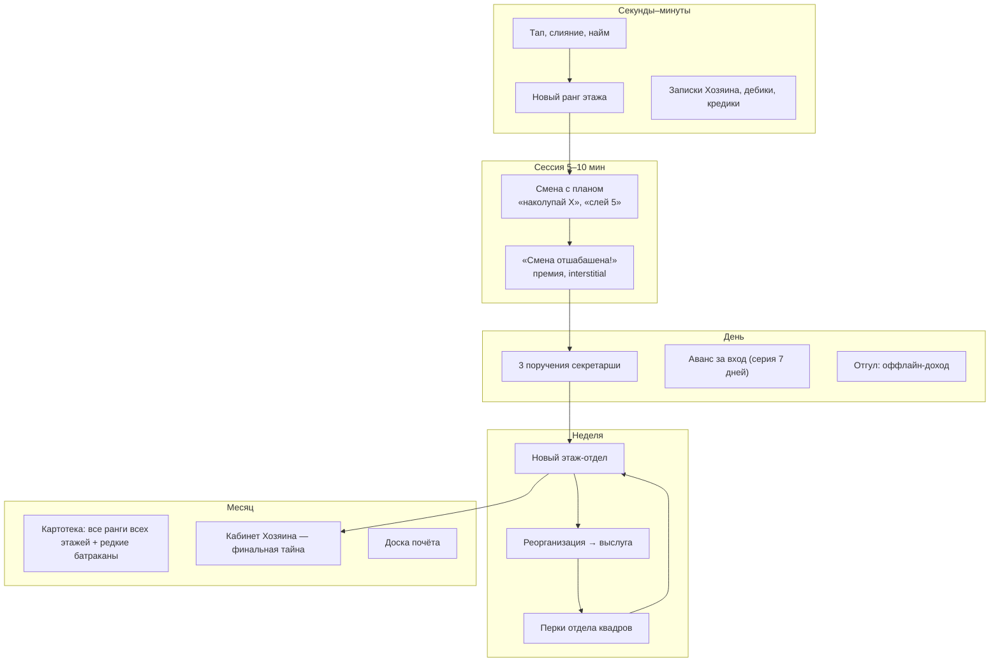

# Долгая игра: куда развивать «Конторку» после среза

> 07.10.2026. Повод: заказчик прошёл срез полностью меньше чем за 10 минут, дальше качаться некуда. Документ отвечает на два вопроса: **почему игра кончилась так быстро** и **из чего во вселенной «Конторки» можно построить игру на дни и недели**. Решение по направлению — за заказчиком, после него обновляются GDD и roadmap.

---

## 1. Диагноз: почему всё кончилось за 10 минут

Это не только отсутствие меты. **Стартовая экономика из GDD оказалась «взрывной»** — это моя ошибка, её показала симуляция.

Симуляция «жадного» игрока на текущих формулах: тапает, нанимает при первой возможности, сразу сливает пары. Логика — настоящий `src/core`; скрипт пока черновой, в Фазе 6 он станет полноценным симулятором баланса `scripts/balance-sim.ts` с тестами на целевой темп.

| Экономика | Ранг 7 | Ранг 10 |
|---|---:|---:|
| Текущая (цена найма ×2.6 за уровень) | 12 с | **12 с** |
| Цена ×3.6, рост 1.15 за найм | < 1 мин | 1 мин |
| Цена ×4.5, рост 1.2, отставание найма 4 | 1 мин | 2 мин |

Даже резкое удорожание почти не помогает, значит дело в устройстве, а не в числах:

1. **Уровень найма растёт сам** (`максимальный ранг − 3`). Когда лучшие батраканы приносят доход 10-го ранга, найм 7-го стоит копейки по сравнению с доходом.
2. **Удорожание сбрасывается** при переходе на новый уровень найма: счётчик ведётся отдельно на каждый уровень.
3. **Нет стоков.** Кроме найма, кукиши тратить не на что, а 8 столов заполняются за минуты.
4. **Нет слоёв поверх:** реорганизация, этажи, ежедневные цели в срез не входили.

**Вывод для экономики** (детальная подгонка — симулятором в Фазе 6):
- уровень найма — **покупаемое улучшение** («квалификация найма» в отделе квадров), дорогое и с крутым ростом цены;
- **один общий счётчик удорожания** на забег, который не сбрасывается;
- **новые стоки**: улучшения столов (+% дохода стола), открытие этажей, перки за выслугу;
- темп задаётся **целевыми временами** (§5), а симулятор подбирает числа под них.

---

## 2. Что нового во вселенной «Конторки» (октябрь 2026)

Прямой доступ к статьям из среды закрыт, поэтому собрано из поисковой выдачи (источники в конце).

| Что | Суть | Что даёт игре |
|---|---|---|
| **Структура «серия = смена»** | каждый ролик — отдельный рабочий день: батракан приходит на смену, «отшабашивает» её и уходит домой ждать следующую | естественный ритм сессии: **смена с планом**, «смена отшабашена!» в конце |
| **Хозяин** | невидимый, решения «сверху», записки | события, а главное — **финальная цель: добраться до кабинета Хозяина**, которого никто не видел |
| **Тося Бося** | секретарша с подчёркнуто наивной подачей | персонаж ежедневных **поручений**, голос подсказок |
| **Кудесница Алеся** (отдел квадров) | оформляет батраканов на работу, фото на пропуск | **постоянные улучшения** за выслугу («личное дело»), найм |
| **Дебики и Кредики** | мелкие офисные существа; батраканы держат «баланс», раздавая им кукиши | дебики приносят кукиши, кредики дают **рискованный заём** |
| **Калоидный ускоритель** | пародия на корпоративный техно-жаргон: звучит научно, не объясняет ничего | бустер (уже в GDD) |
| **Шабашка / батрачка** | задания без ясного смысла, каждый додумывает своё | формат поручений и мини-целей |
| **Слоповина** | подвальная свалка | уже в игре |
| **«Тихие сокращения»** | ушедших не заменяют, нагрузку раскидывают на оставшихся; держатся за место, а не за повышение | событие-вызов **«Проверка сверху»**: успел — награда, не успел — без наказания |
| **Ремиксы по профессиям** | «конторка дизайнеров», «конторка СММщиков», «врачильная конторка» | **этажи-отделы**: каждая профессия — свой отдел со своей линейкой рангов |
| **Ремиксы по городам** | «Конторка „Омск“: выбирай батрачку» | возможные тематические события и обновления |

**Конкурент.** Уже вышла фанатская игра **«Конторка: батракан в офисе»** (разработчик Кирилл Конищев, Android и iOS). Это сборник мини-игр в окнах рабочего монитора («ПОБЕГ.exe», «ГРОССБУХ.xls», «БУМАЖКИ.exe»), в ней есть Кудесница Алеся и кукиши. Жанр другой: у нас idle-merge с долгой прогрессией, у них аркадные мини-игры.

Одна сводка поиска утверждала, что игра есть и на Яндекс Играх, но подтвердить это из среды нельзя `[verify]`. **Проверь, пожалуйста, на телефоне поиск «Конторка» в Яндекс Играх.** Если она там есть, это влияет на название и на то, как мы выделяемся.

**По правам.** Тося Бося и Кудесница Алеся — **именные персонажи** автора оригинала. Это ближе к его авторскому контенту, чем общий словарь (батраканы, кукиши), который разошёлся по ремиксам. Варианты — в вопросах §8.

---

## 3. Как idle-игры держат игрока неделями

У долгих idle-игр (Cookie Clicker, AdVenture Capitalist, Idle Miner Tycoon, merge-игры) прогрессия устроена слоями, и у каждого слоя свой масштаб времени:

| Масштаб | Что делает игрок | Зачем |
|---|---|---|
| секунды | тап, слияние | моментальный отклик |
| минуты | цель «следующий ранг / следующая покупка» | всегда есть, к чему тянуться |
| сессия (5–10 мин) | закрыть план, получить награду | естественный конец сессии и повод вернуться |
| день | ежедневные задания, награда за вход, оффлайн-доход | привычка заходить |
| неделя | новый этаж, престиж (сброс ради множителя) | ощущение большого роста |
| месяц | финальная цель, коллекция, обновления | смысл «играть дальше» |

У среза есть только первые две строки. Добавить нужно четыре остальные.

---

## 4. Три направления

### A. «Вертикаль Конторки» — рекомендую

**Здание Конторки — это этажи-отделы, и игрок поднимается снизу вверх, к кабинету Хозяина.**

- Каждый этаж — отдел-ремикс со своей линейкой из 10 рангов, своей внешностью батраканов и своим «чем колупают»: Бухгалтерия (циферки) → Склад (коробки) → Конторка дизайнеров (макеты) → СММ-конторка (лайки) → Врачильная конторка (справки) → IT-отдел (баги) → Приёмная (секретарша) → **Кабинет Хозяина**.
- Этажи работают **одновременно** (idle), между ними — **лифт**. Каждый следующий этаж стоит экспоненциально дороже, поэтому открывается после реорганизаций.
- **Реорганизация** (престиж): сброс персонала и кукишей, этажи остаются открытыми. Выслуга тратится в **отделе квадров** на постоянные перки: +1 стол, стартовая квалификация найма, оффлайн дольше, дебики чаще, автослияние и т.д.
- **Финальная тайна:** на верхнем этаже наконец «увидеть Хозяина». К релизу кабинет закрыт («Хозяин занят»), открытие — большим обновлением-событием.

✅ Есть видимая долгая цель (здание растёт вверх), сильный мем-крючок («что за Хозяин?»), этажи — это прямо культура ремиксов мема.
✅ Новые этажи почти бесплатны в производстве: внешность ранга — это конфиг для генератора, этаж — один атлас примерно на 160 КБ.
⚠️ Больше UI (лифт, экраны этажей) и сложнее баланс параллельных этажей.

### B. «Ремиксы профессий» — горизонтально

Те же отделы-профессии, но как **отдельные конторки**, открываемые в любом порядке, с упором на коллекцию батраканов.

✅ Много разнообразия, удобно выпускать обновления.
❌ Нет общей цели и вертикального роста: игрок не понимает, «куда идёт». Удержание слабее, чем у A.

### C. «Смены и сокращения» — активная игра с вызовами

Упор на ежедневные смены с планом, «проверки сверху» и вызовы, сюжетные записки Хозяина.

✅ Активнее, больше событий и эмоций, сильнее отражает тему «тихих сокращений».
❌ Это уже не idle: игрок должен быть в игре, а оффлайн-прогресса меньше. Для широкой казуальной аудитории Яндекса рискованнее.

**Рекомендация:** A как каркас + лучшее из B и C. Этажи и есть ремиксы профессий (B). Смены с планом, поручения и «проверка сверху» — дневной слой (C).

---

## 5. Рекомендованная структура (A + элементы B и C)

### 5.1. Слои и механики

| Слой | Механика | Источник в лоре |
|---|---|---|
| Ядро | тап, найм, слияние, 10 рангов на этаж | батраканы колупают циферки |
| Новые стоки | **квалификация найма** (покупается), **улучшения столов** (монитор, кресло, калькулятор → +% дохода стола), открытие этажей | отдел квадров, ЭЛТ-мониторы |
| События | записки Хозяина (аврал, шабашка, подарок), дебики (бонус), **кредики** (заём: +N сейчас, вернёшь ×1.5 через 2 мин — по желанию), **«Проверка сверху»** (вызов на 60 с: успел — ×3 награды, не успел — ничего не теряешь) | Хозяин, дебики и кредики, тихие сокращения |
| Сессия | **смена с планом**: одна понятная цель на 5–10 минут, в конце — «Смена отшабашена!» и премия (настоящая) | «серия = смена» |
| День | **3 поручения** секретарши (сбрасываются ежедневно), аванс, отгул | секретарша |
| Неделя | **этажи-отделы** (лифт), **реорганизация** → выслуга → **перки** отдела квадров | ремиксы профессий, Кудесница |
| Коллекция | **картотека**: 10 рангов × этажи + **редкие варианты** (например, «позолоченный батракан», шанс 1% при найме, доход ×2 — генератор рисует их сменой палитры) | личные дела отдела квадров |
| Финал | **кабинет Хозяина** на верхнем этаже — раскрытие тайны большим обновлением | невидимый Хозяин |
| Соревнование | доска почёта: высший этаж / выслуга | — |

### 5.2. Целевой темп (под него симулятор подбирает числа)

| Веха | Время игры (суммарно) | Календарно при 15–20 мин в день |
|---|---|---|
| Ранги 1–5 первого этажа, первое поручение | 5–10 мин | 1-я сессия |
| Ранг 10 Бухгалтерии | 45–60 мин | 1–2 день |
| Первая реорганизация | ~2 ч | 2–3 день |
| Этаж 2 (Склад) | ~2–3 ч | 3–4 день |
| Этаж 3 (Конторка дизайнеров) | ~6–8 ч | ~неделя |
| Все этажи релиза + полная картотека | 15–20 ч | 3–4 недели |
| Кабинет Хозяина | обновлением | ~через месяц после релиза |

---

## 6. Объём и сроки

**MVP к модерации:**
- новая экономика + симулятор баланса с тестами на целевой темп (§5.2);
- **3 этажа** (Бухгалтерия, Склад, Конторка дизайнеров) с лифтом;
- реорганизация + ~6 перков отдела квадров;
- квалификация найма и улучшения столов;
- смена с планом, 3 поручения в день, аванс, отгул;
- записки, дебики, кредики, «проверка сверху»;
- картотека (30 рангов + редкие варианты), доска почёта;
- реклама и SDK (Фаза 7).

**После релиза, обновлениями раз в 1–2 недели:** этажи 4–6 (СММ, Врачильная, IT), приёмная, событие «Кабинет Хозяина», городские ремиксы.

**Влияние на график.** Фаза 6 вырастает примерно с 4 до 8–9 рабочих дней. Отправка на модерацию сдвигается **с ~20.10 на ~24–27.10**.

Альтернатива: к модерации выйти с 2 этажами и без кредиков и «проверки сверху» (~22–23.10), а остальное добавить первым обновлением. Цена — меньше контента в первую неделю, когда решается удержание.

---

## 7. Риски

| Риск | Что делаем |
|---|---|
| Раздувание объёма → срыв сроков | жёсткий список MVP (§6), всё остальное — обновлениями |
| Сложный баланс нескольких этажей и престижа | симулятор с целевым темпом и тесты на него — до любой полировки |
| Мем остывает | долгая структура не зависит от мема: офисная вертикаль и тайна Хозяина держат и без хайпа |
| Конкурент уже есть | другой жанр (idle-merge против мини-игр); проверить его присутствие на Яндекс Играх |
| Именные персонажи оригинала | решение в вопросах ниже |

---

## 8. Вопросы к заказчику

1. Направление: **A** (рекомендую, с элементами B и C), чистый **B** или **C**?
2. Объём к модерации: **3 этажа и полный набор** (отправка ~24–27.10) или **2 этажа облегчённо** (~22–23.10)?
3. Персонажи оригинала:
   - **по ролям**, без имён («секретарша», «кудесница из отдела квадров») и в нашем дизайне — узнаваемо для фанатов и безопаснее;
   - **с именами** (Тося Бося, Кудесница Алеся) — максимальная узнаваемость, но выше риск по правам.
4. Есть ли «Конторка» на Яндекс Играх — проверь поиском в приложении.

---

## Источники

- [Хабр — «Что такое конторка, зачем нужен калоидный ускоритель…»](https://habr.com/ru/companies/speshu_ai/articles/1088412/) · [Код](https://kod.ru/speshu-ai-ooo-slop-kontorka) · [Афиша Daily](https://daily.afisha.ru/infoporn/35986-ya-tozhe-poluchayu-zarplatu-kukishami-pochemu-kontorka-tak-pohozha-na-nashu-zhizn/) · [Цех](https://zeh.media/ponyat/4397086-kontorka) · [allweb](https://allweb.ru/ii-i-nejroseti/mem-kontorka-chto-znachit-kto-takie-batrakany-i-pochemy-im-platiat-kykishi/) · [NGS55 — «Конторка „Омск“»](https://ngs55.ru/text/entertainment/2026/09/19/76644614/)
- [«Конторка: батракан в офисе» — Google Play](https://play.google.com/store/apps/details?id=app.kontorka)
- Прямой доступ к этим сайтам из среды закрыт прокси, факты собраны из поисковой выдачи.
